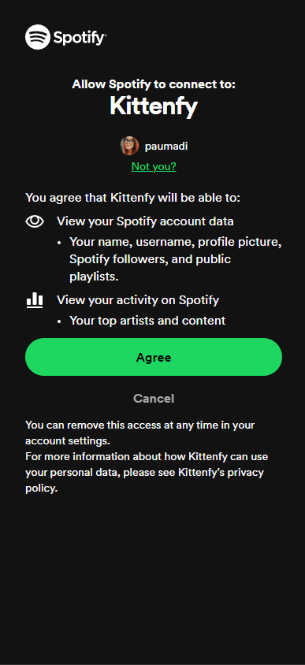
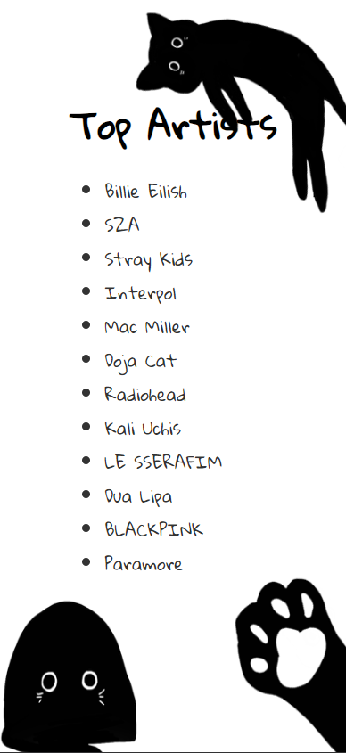

# Kittenfy

The page retrieves data from Spotify and displays the user's top artists. The name is because of the background image, which is a doodle off my black cat.

Implementation is very simple: Login --> get the top artists --> display the data.

This app is registered in the Spotify's website for developers, since it is mandatory to be able to use the authentification process and get the data.

## Screenshots

## React + Vite

I used the Vite template for React which provides a minimal setup to get React working really fast.
